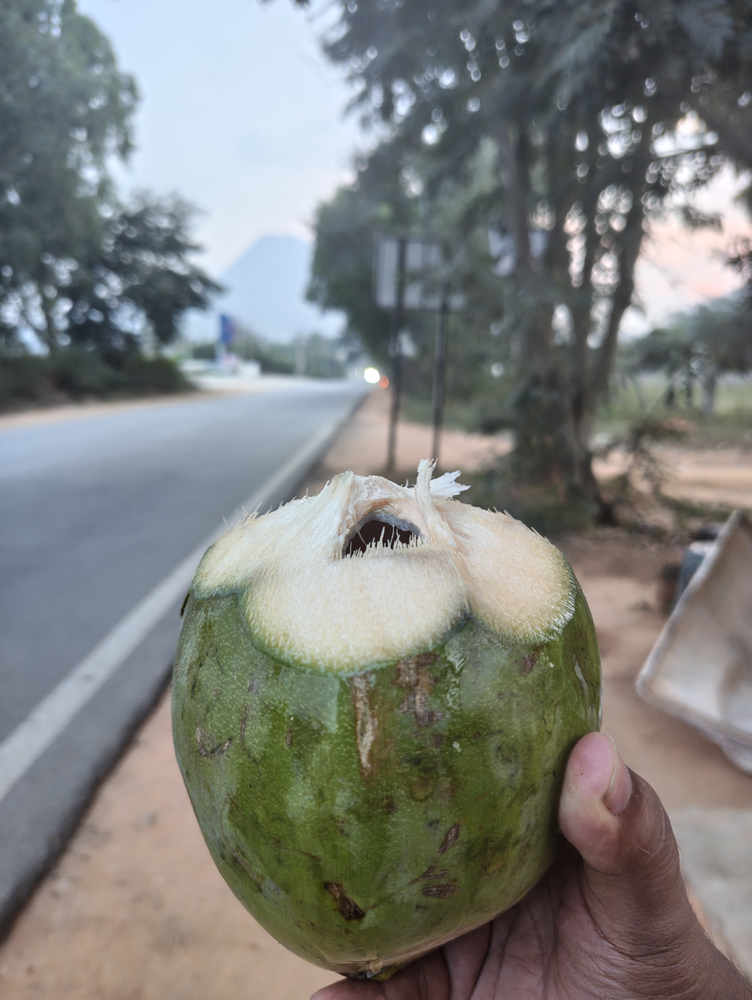

+++
title = 'Weekly Note 50/2025'
date = '2025-12-14T10:39:06+05:30'
draft = false
tags = ['weekly-notes','personal']
summary = 'A relaxing outing followed by busy work'
+++

<!-- align center and medium sized image -->

### What happened
The week started with an outing that my collegues planned, we visited a farm stay on the foothills of Nandi Hills. The place was [chikoo(sapodilla) farm stay](https://maps.app.goo.gl/UzEnFZXB78BvikBA6) and it's owned by my collegue's in laws. It was a really cozy night with bonfire and good home made biryani. The rest of the week at work was pretty hectic as a major project of mine was rolling out a feature on which I have been working on since April, finally shipping it felt really good. I also managed to raise PR's for other projects which was in my backlog for a while. I traveled to office 3 days this week and I think I'm getting used to the long travel (~2hrs) which is not ideal but I plan on moving closer to my work in some months time.

### What I learned
I had to build a sync service and we were using DynamoDB store data for that project. We used Lambda which was timing out since it was not ideal to make one Lambda run a insertions for large volumes of data. Then I did some research and GPT and found we can use SQS to send notifications to the queue and then trigger concurrent Lambda's which would process message which contain record data for insertion. This worked amazingly well and kept the costs and overhead at a minimum.

### What I played
After contemplating a lot I caved in and bought Hades which is rouge-like action RPG which I saw one of my friend play back in college, at the time I did not have the machine which could run it. I love the game, the music, character design, dialogues, in game store and economics all of them are top notch. I really love the fact that the game encouraging us to use different weapon in each run and I found myself enjoying it a lot. say. Although I am yet to beat it but still 10/10 game.

### What I read
I am closing in on climax of [The Dark Half](https://www.goodreads.com/book/show/11597.The_Dark_Half) by Stephen King, the story is getting interesting as the protagonist has a lot at stake now, I think I will finish it by this week. This is my first King novel and I like the way he writes, especially the killing gorey scenes of his are most fun to read. I think I'm all up for picking up another King novel next.
