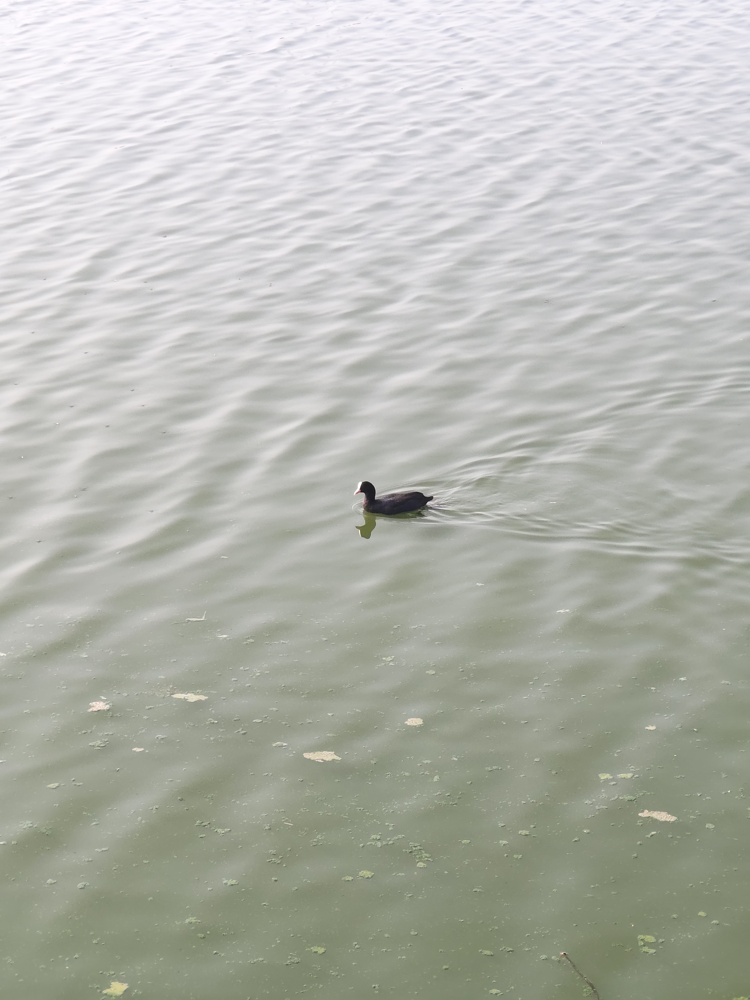

+++
title = 'weekly note #52 (2025)'
date = '2025-12-28T15:07:10+05:30'
draft = false
tags = ['weekly-notes','personal']
summary = 'Last week of 2025'
+++

### What happened
This week was eventful and calming, I met and celebrated Christmas Eve with friends which was very refreshing and motivating. We prepared sandwiches and dessert, played a card game called 'Kaboo', spent the next morning walking around the lake where I learned about silver oak tree thanks to my flora obessed friend. Work calmed down but it was my manager's last working so my team had a farewell call to thank him for being an amazing leader and even better human. I learned a lot from him.

### What I learned
This week I didn't do much but got to know how Adjacency Matrix and Adjacency List's are populated to store Graph Data Structure and how space complexity in Adj. Matrix might be larger since we store the elements in a 2D matrix and even if the edges doesn't exist it still sits taking up that space, for that reason if the Graph is dense with most of the nodes touching all the edges then Matrix makes more sense. Other than that I optimised my 8 year old machine for which I have written a separate blog [here](https://adnansaliq.in/posts/blogs/how-i-revived-my-8-yr-old-machine).

### What I played
Been playing hades for the past week now, I have beat the game but it requires us to beat the boss multiple times to progress in main story which is fun since we can now increase the difficulty and all the other Gods have updated lore and dialgoues, I am amazed at how each interaction with te characters every time is unique and fresh,truly a good game.

### What I read
I completed [The Dark Half](https://www.goodreads.com/book/show/11597.The_Dark_Half) which is my first King novel and honestly it was a fun read and I really like his writing style and characterisation. Considering it was one of his weaker novels I am looking forward to reading his more renowed work. As for my current read I have started reading [A Psalm for the Wild Built](https://www.goodreads.com/book/show/40864002-a-psalm-for-the-wild-built) which is part 1 of a 2 part book. It is an easy comfort read and revolves around a monk who meets a robot in wilderness in a solarpunk world where after abonding humans for many years this robot is assigned with the task for knowing the answer for 'what do people need?'