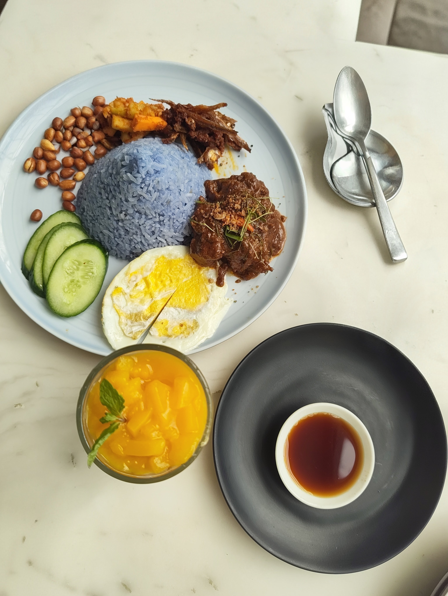
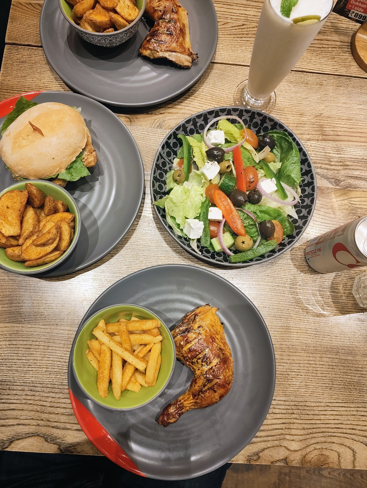

+++
title = 'weekly note #04 (2026)'
summary = 'Lots of food and fun at work'
tags = ['weekly-note']
date = '2026-01-26T19:21:34+05:30'
draft = false
+++

### What happened
The week started with work stuff and meeting a collegue who flew from Croatia to connect with our regional team. He can handle Indian spices well and it was easier for me to show him around and make him try Indian cuisines and so far it has been a treat for both of us. Work was moderate and I managed most of it and was able to close some backlog tickets. My sleep cycle has been a little off this week so will try and get it back to same routine in the next couple of weeks.

    
    

### What I learned
The week I only got time to learn about logging and how to monitor Grafana, ElasticSearch etc at work. Pretty light tbh. Will pick up Spring security back and try to complete that.

### What I read
I'm reading [An Immense World by Ed Yong](https://www.goodreads.com/book/show/59575939-an-immense-world), this caught my eye since it speaks about how Animals percieve the world using their senses and how the same world is different for differnt species and so far it has been amazing, got to know about how dog smells and what makes them so good at it.

### What I am playing
Started with quests for The Witcher 3 Blood and Wine expansion and it is beautiful world, CD Project Red has proved why it's such an amazing game.

I have been thinking for a while to not stick to this format of weekly notes as it makes me want to stick to it which I am bad at so I will try and experiment for the next couple of months to see what suits me. Until then.

Ciao