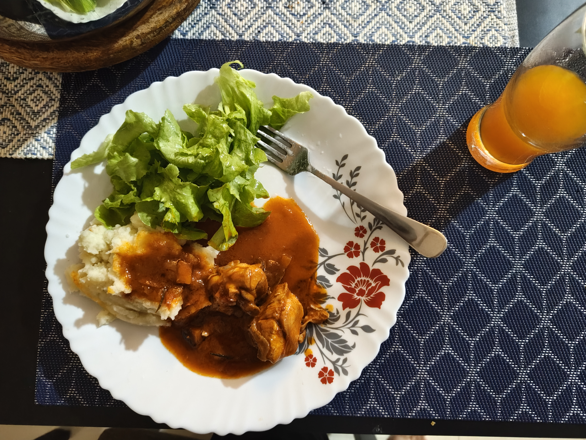
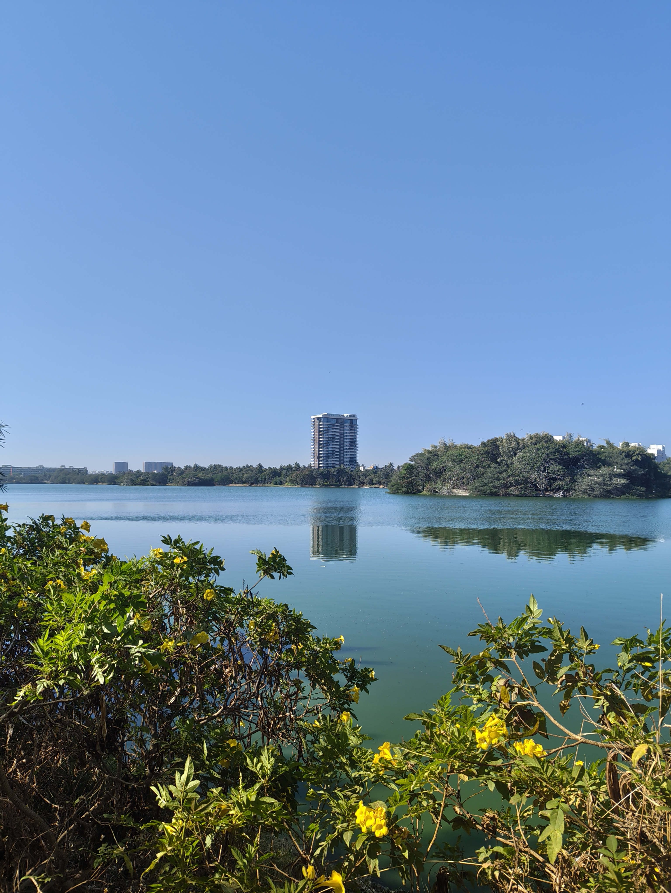
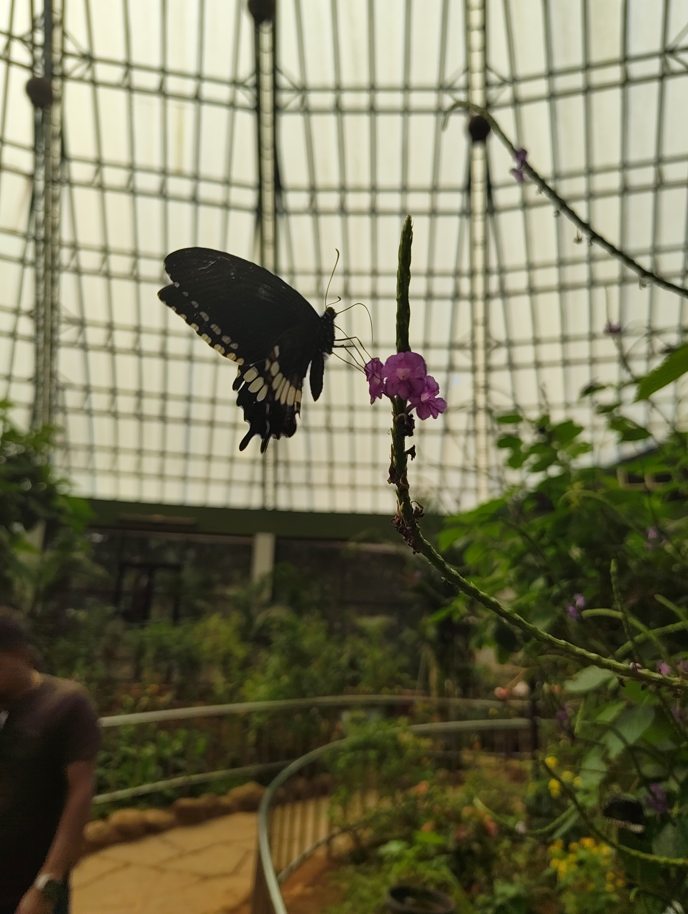

+++
title = 'weekly note #6 (2026)'
summary = "work, food, park and lots of travel"
date = '2026-02-08T21:38:20+05:30'
draft = false
tags = ["weekly-note"]
+++

## What happened
The week started with a normal Monday at work but shifted gears when I recived an escalation ticket which I had to resolve soon followed by fever and blocked nose where I had to take one day off and recover since on Thursday I had to pack my clothes and move in with my collegues until the weekend.

### Night Outs
Come Thursday the day was spent on working, I configured a SNS service on AWS to alert over Email in case of any crictical failure for one of my microservices, it was fun. At night we went to my colleugue's place who was visiting India and there he prepared Chicken Paprikash with Mashed Potato and Spaghetti which was soul satisfyingly good. It was honestly the best kind of team building. We jammed I learned basics of Seven Nation Army on his guitar.

### Walk by the lake
The next morning before work we took a walk by the lake and it was the most calming walks in a very long time where I also had some really good talk. It might be the cleanest lake I have been to in Bangalore.

### A day out at the national park
We had booked a jeep safari at the national park for which we were excited but it turned out to be disappointing, even though the animals roamed freely it was very heavily controlled and the sight of elephants being chained was just really sad(they did that so that they don't attack the jeep). Lions, leopards and tigers they all looked bored since they didn't get to hunt and the food is just given to them. I don't thin I will ever go there. Butterfly park was fun and I got tickeled by some of them.

