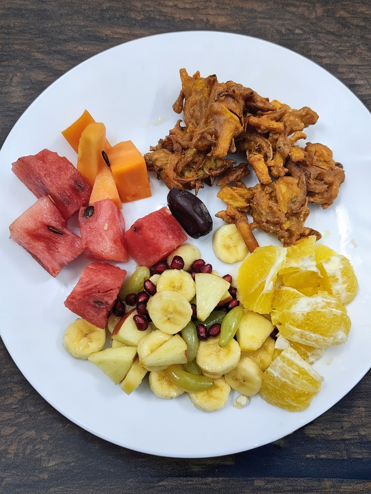
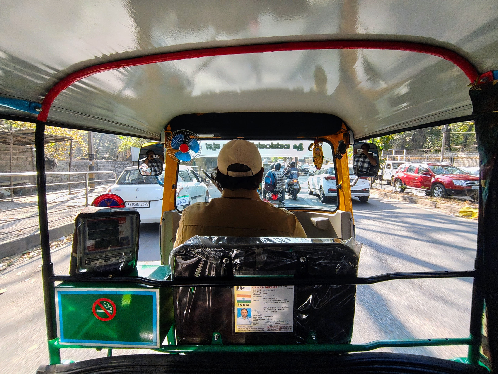

+++
title = 'weekly note #08 (2026)'
summary = "catching up with friends and ramadan"
date = '2026-02-22T21:00:00+05:30'
draft = false
tags = ["weekly-note"]
+++

## What happened
Overall a very chill week where I met my childhood friend and together, we searched for places to stay and after few tiring walks in the neighbourhoods and looking over a dozen of places found a super chill place at a very good location. It felt really nice connecting after such a long time and I also took lunch at their BnB where we worked and chilled during most of the day. During the weekend we partied a little. This week Ramadan had also started so waking up super early eating something before sunrise and then fasting all day until sunset is going to be the norm for the next 30 days. It was initially really difficult but as the week progressed the habit has started to set in and it is becoming an enriching experience for the body.

At work, made good progress at resolving certain tickets and will hopefully close a couple of projects next week. I get to travel to Mumbai again in 2 weeks so excited for that and have to prepare for that. Learned a lot about concurrent systems and multithreading since I will be using that in some of the upcoming projects.

To add captions to images in markdown, you can use figure elements or simple markdown syntax. Here's a cleaner approach for your content:

<figure style="display:flex; gap:10px; justify-content:center;">
    

        
        <figcaption>Breaking fast with some fruits and dates and some fried onion chips</figcaption>
    

    

        
        <figcaption>Auto ride I took after a long time</figcaption>
    

</figure>

### Blogroll is live!
Completed blogroll configuration and it is [live](https://adnansaliq.in/fav-blogs), right now it is building the page locally as Substack RSS blocks Github VMs from fetching their feed. Will look for some kind of alternative until then it should update whenever I publish a new post. Honestly RSS is really underrated piece of tech and I am moving towards incorporating it more in my internet consumption.